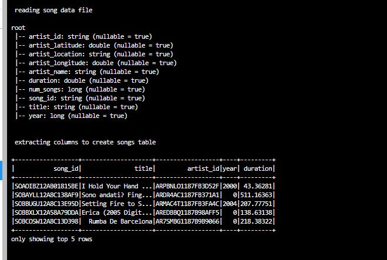
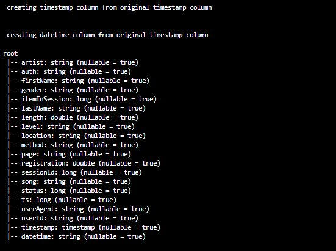
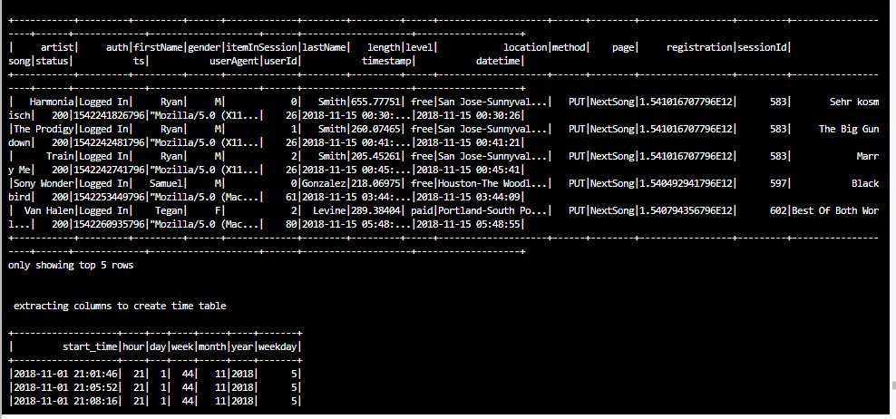

# Udacity-Data-Lake-with-Spark
This project required me to build an ETL pipeline for a data lake hosted on S3. To complete the project, I had to load data from S3, process the data into analytics tables using Spark, and load them back into S3. I deployed this Spark process on a cluster using AWS.

# 1. Introduction

A fictional music streaming startup, Sparkify, has grown their user base and song database even more and want to move their data warehouse to a data lake. Their data resides in S3, in a directory of JSON logs on user activity on the app, as well as a directory with JSON metadata on the songs in their app.

As their data engineer, I was tasked with building an ETL pipeline that extracts their data from S3, processes them using Spark, and loads the data back into S3 as a set of dimensional tables. This will allow their analytics team to continue finding insights in what songs their users are listening to.

# 2. Song Dataset

Each file is in JSON format and contains metadata about a song and the artist of that song. The files are partitioned by the first three letters of each song's track ID. For example, here are filepaths to two files in this dataset.
  ```json
  {"num_songs": 1, "artist_id": "ARJIE2Y1187B994AB7", "artist_latitude": null, "artist_longitude": null, "artist_location": "", "artist_name": "Line Renaud", "song_id": "SOUPIRU12A6D4FA1E1", "title": "Der Kleine Dompfaff", "duration": 152.92036, "year": 0}
  ```
# 3. Log Dataset

The second dataset consists of log files in JSON format generated by this event simulator based on the songs in the dataset above. These simulate app activity logs from an imaginary music streaming app based on configuration settings.

### Fact Table
1. songplays - records in event data associated with song plays i.e. records with page NextSong
    * songplay_id, start_time, user_id, level, song_id, artist_id, session_id, location, user_agent
### Dimension Tables
2. users - users in the app
    * user_id, first_name, last_name, gender, level
3. songs - songs in music database
    * song_id, title, artist_id, year, duration
4. artists - artists in music database
    * artist_id, name, location, lattitude, longitude
5. time - timestamps of records in songplays broken down into specific units
    * start_time, hour, day, week, month, year, weekday


# 2. Data Lake Design & Implementation
Data is to be obtained from the s3 bucket, Song and Artist Tables are populated using the song_data directory.
Log_data is used to populate user and time table, while a join between log_data & song_data is used to create the songplay table.
Upon creation of tables, parquet files were also generated and written to an s3 bucket.


The data is read using:
``` python
song_data = input_data + "song_data"
df = spark.read.json(song_data)
```

The addition of timestamp and datetime columns was created using:
``` python
    # create timestamp column from original timestamp column
    print("\n creating timestamp column from original timestamp column \n")
    from pyspark.sql import types as T
    get_timestamp = udf(lambda ts: datetime.fromtimestamp(ts / 1000.0), T.TimestampType())
    df_filtered = df_filtered.withColumn("timestamp", get_timestamp("ts"))
    
    # create datetime column from original timestamp column
    print("\n creating datetime column from original timestamp column \n")
    get_datetime = udf(lambda ts: datetime.strftime(ts, '%Y-%m-%d %H:%M:%S'))
    df_filtered = df_filtered.withColumn("datetime", get_datetime("timestamp"))
    df_filtered.printSchema()
    df_filtered.show(5)
```

The join performed to create songplay was  created using:
``` python
# read in song data to use for songplays table
    print("\n read in song data to use for songplays table \n")
    song_data = input_data + "song_data"
    df_sd = spark.read.json(song_data)
    df_log_song_joined = df_filtered.join(df_sd, (df_filtered.artist == df_sd.artist_name) & \
                                              (df_filtered.song == df_sd.title) & \
                                              (df_filtered.length == df_sd.duration))

    # extract columns from joined song and log datasets to create songplays table
    print("\n extracting columns from joined song and log datasets to create songplays table \n")
    df_log_song_joined = df_log_song_joined.withColumn("songplay_id",F.row_number().over(Window.orderBy("artist_id")))
    df_log_song_joined.createOrReplaceTempView("songplays_table_temp")
    songplays_table = spark.sql("""
                                SELECT  DISTINCT
                                        songplay_id,
                                        datetime  AS start_time,
                                        userId    AS user_id,
                                        level,
                                        song_id,
                                        artist_id,
                                        sessionId AS session_id,
                                        location,
                                        userAgent AS user_agent
                                FROM songplays_table_temp
                                """).dropDuplicates()
```


## 2.3 etl.py: 
In the etl file the json files were read and used to populate the tables in the schema. 
    
Sample Result:



